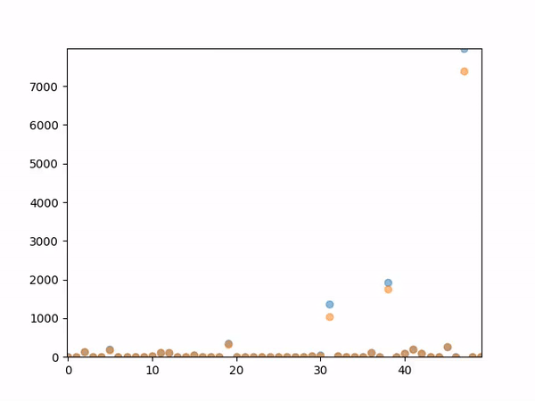

# Mabrains-Task-Transistor-Drain-Current-Prediction


## Overview

Prediction of nmos transistor drain current based on nmos simulated data.

## Table of Contents
- [Mabrains-Task-Transistor-Drain-Current-Prediction](#mabrains-task-transistor-drain-current-prediction)
  - [Overview](#overview)
  - [Table of Contents](#table-of-contents)
  - [Workflow](#workflow)
    - [Exploratory data anylysis.](#exploratory-data-anylysis)
    - [Data Preprocessing](#data-preprocessing)
    - [Model](#model)
    - [Loss](#loss)
    - [Training](#training)
    - [Evaluation](#evaluation)
    - [Plots](#plots)

## Workflow

### Exploratory data anylysis.
* Dropped two features 'drain_length(um)','temperature' both were constant for all data samples.
* Features used [vds,	L(um),	W(um),	vgs,	vsb,	corner]


### Data Preprocessing

* Feature scalling (min-max).
* Shift target by 10.
* log10 shifted_targets.
  

```python
min=torch.tensor([-0.50,	0.15, 0.36,	 0.0, 0.0, 0])
max=torch.tensor([2.50,	8.00, 25.00, 1.8, 1.5, 4])
sample['features'] = (sample['features']-min)/(max-min)
sample['labels'] = torch.log10(sample['labels']+10)  
return sample
```

### Model

Shallow Neural Network with batch normalization layer and LeakyReLU activation function.

```python

self.model = nn.Sequential(
                nn.Linear(input_shape, 32),
                self.activation,
                nn.BatchNorm1d(32),
                nn.Linear(32, 32),
                self.activation,
                nn.BatchNorm1d(32),
                nn.Linear(32,32),
                self.activation,
                nn.BatchNorm1d(32),
                nn.Linear(32,32),
                self.activation,
                nn.BatchNorm1d(32),
                nn.Linear(32,32),
                self.activation,
                nn.BatchNorm1d(32),
                nn.Linear(32,output_shape)
            )
```
### Loss
* Mean absolute percentage error.
* data rescaled before loss calculations.

```python
def MAPE_loss(output, target):
    """
    Mean absolute percentage error loss.

    Arguments:
        output: output of the model
        target: target values

    Returns:
        MAPE loss.
    """
    output=torch.pow(10,output)
    target=torch.pow(10,target)

    return torch.mean(torch.abs((target - output) / (target)))  
```
### Training
* Batch_Size -> 256
* Learning_Rate -> 0.01
* Num_of_Epochs -> 50
* xavier initialization
* Learning_Rate Scheduler 
    
        LinearLR
        start_factor=1.0 
        end_factor=0.01
        total_iters=40


### Evaluation
* MAPE
        Train ACC -> 0.09565
        Val ACC -> 0.02738
        Test ACC -> 0.02738

* Marginal Accuracy
    ```python
    def marginal_acc(y_pred,labels,margin=0.05):
    """
    Calculates marginal accuracy.

    Arguments:
        y_pred: predicted values
        labels: actual values
        margin: margin to be considered.

    Returns:
        Marginal accuracy.
    """
    y_pred=10**y_pred 
    labels=10**labels 
    return torch.mean((torch.abs((y_pred-labels)/labels)<margin).float())

    ```
    | Margins           | ACC        |
    | :---------------- | :------:   | 
    | 0.1               |   0.9776   | 
    | 0.05              |   0.8357   | 
    | 0.01              |   0.3604   | 

### Plots


* Loss Plot
    

* Data Visualization gif
    


